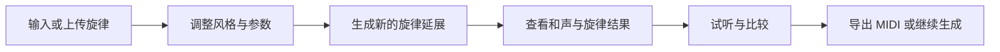
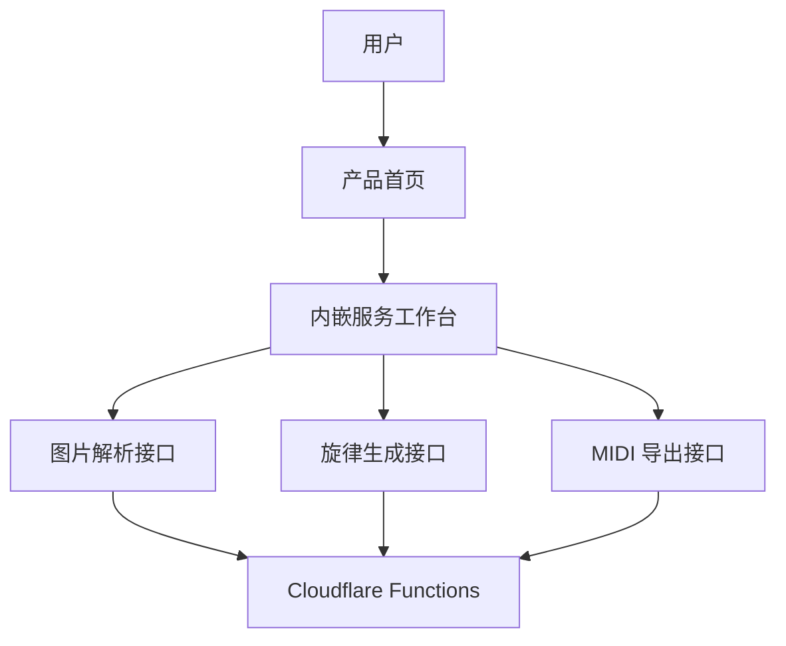

# MuseMelody

[简体中文](README.md) | [English](README_EN.md)

> 面向公开用户的 AI 旋律续写与乐谱生成工作台。

MuseMelody 是一个帮助用户基于已有旋律继续创作的网站。

用户可以从乐谱、MIDI、MusicXML、图片或文字描述出发，生成新的旋律片段、和声建议与试听结果，并在同一界面里完成输入、生成、试听和导出。

## 产品简介

很多音乐创作并不是从空白页开始，而是从一段已经存在的旋律继续发展。

MuseMelody 当前主要服务这类场景：

- 给一段已有旋律继续往下写
- 为现有主题寻找新的发展方向
- 快速比较不同版本的旋律走向
- 在网页里直接试听、调整与导出结果

## 当前体验

当前线上版本已经具备完整的产品流程：

1. 输入旋律
   支持乐谱图片、键盘录入、预设旋律或文字描述。

2. 调整参数
   支持设置风格、音色、速度与生成长度。

3. 生成结果
   返回新的旋律片段、和声建议与节奏信息。

4. 试听与导出
   支持试听原旋律、生成旋律、合并结果，并导出 MIDI 文件。

5. 图片识别接入
  当前站点已接入兼容 OpenAI API 的图片识别链路，并支持钢琴大谱表提示、`staves + notes` 双结构返回，以及回退占位流程。

## 核心能力

- 旋律续写与即兴生成
- 和声方向建议
- 乐谱图片输入识别、双谱表结构输出与回退占位流程
- 网页内即时试听
- MIDI 导出
- 首页内嵌成熟工作台体验

## 使用流程



## 站点架构



## 仓库结构

```text
public/
  index.html              产品首页
  styles.css              首页样式
  studio/                 内嵌服务的构建产物
functions/
  api/
    score/parse.js        乐谱图片解析接口
    improv/generate.js    旋律生成接口
    midi/export.js        MIDI 导出接口
studio-source/
  frontend/               成熟服务前端源码（Vite + React）
  backend/                原始 Python/FastAPI 参考实现
scripts/
  build-studio.mjs        构建服务并注入首页的脚本
```

## 关键文件

### 产品首页

- [public/index.html](public/index.html)
- [public/styles.css](public/styles.css)

### 成熟服务源码

- [studio-source/frontend/src/InspirationMuse.jsx](studio-source/frontend/src/InspirationMuse.jsx)
- [studio-source/frontend/src/App.jsx](studio-source/frontend/src/App.jsx)
- [studio-source/frontend/src/embed.jsx](studio-source/frontend/src/embed.jsx)
- [studio-source/frontend/vite.config.js](studio-source/frontend/vite.config.js)

### 站内 API

- [functions/api/score/parse.js](functions/api/score/parse.js)
- [functions/api/score/temp/upload.js](functions/api/score/temp/upload.js)
- [functions/api/score/temp/[token].js](functions/api/score/temp/%5Btoken%5D.js)
- [functions/api/improv/generate.js](functions/api/improv/generate.js)
- [functions/api/midi/export.js](functions/api/midi/export.js)

其中 `score/parse` 现在支持：

- `score_type` 提示参数
- `staves + notes` 双结构返回
- 顶层 `notes` 的向后兼容

## 本地运行

### 1. 安装根项目依赖

```bash
npm install
```

### 2. 安装成熟服务前端依赖

```bash
cd studio-source/frontend
npm install
```

### 3. 构建成熟服务

```bash
cd ../../..
npm run build:studio
```

### 4. 本地启动站点

```bash
npm run dev
```

## 部署说明

当前项目适合部署到 Cloudflare Pages。

推荐配置：

- Framework preset: `None`
- Build command: 留空
- Build output directory: `public`

当你更新 `studio-source/frontend/` 中的成熟服务源码后，请先执行：

```bash
npm run build:studio
```

这样首页内嵌的服务脚本才会同步更新。

## 当前实现说明

当前线上版本使用：

- Cloudflare Pages 静态前端
- Cloudflare Pages Functions API
- 嵌入首页的成熟服务构建产物
- 兼容 OpenAI API 的图片识别接入方式

仓库中的 [studio-source/backend](studio-source/backend) 保留了原始 Python/FastAPI 参考实现。

当前图片识别流程已经支持：

- 通过环境变量配置 `OPENAI_API_KEY`
- 通过环境变量配置兼容端点 `OPENAI_BASE_URL`
- 通过环境变量配置模型名 `OPENAI_MODEL`
- 通过 `score_type` 提示引导钢琴大谱表识别
- 返回 `treble / bass` 双谱表结构（当识别成功时）
- 在识别失败时自动回退到占位识别流程

## 路线图

后续可以继续增强的方向包括：

- 接入真实 OMR 乐谱识别模型
- 接入更真实的旋律生成推理服务
- 增加生成历史与版本比较
- 增强导出、播放和状态反馈
- 增加用户系统与作品保存能力

## 仓库说明

本仓库并非开源软件仓库。

请参见：

- [LICENSE](LICENSE)
- [NOTICE](NOTICE)
