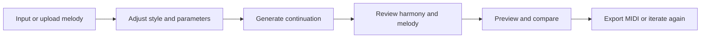
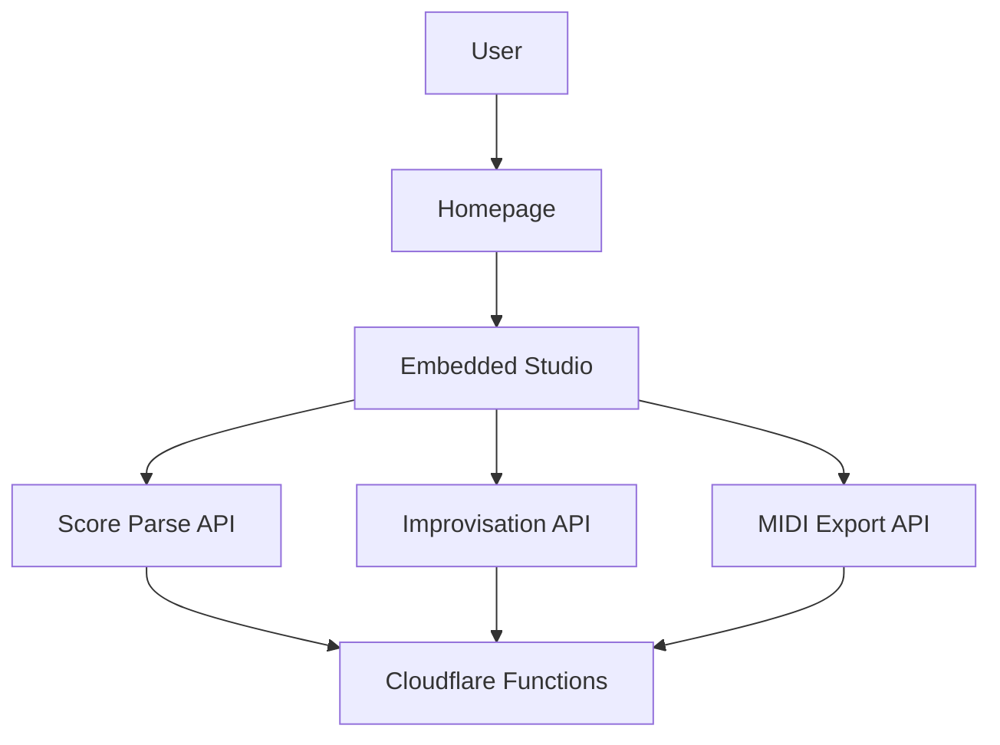

# MuseMelody

[简体中文](README.md) | [English](README_EN.md)

> An AI melody continuation and score-to-improvisation workspace for public users.

MuseMelody is a web product designed to help users continue writing from existing musical material.

Users can start from scores, MIDI, MusicXML, images, or text prompts, then generate new melodic continuations, harmony suggestions, and previewable results in a single interface.

## Product Overview

A lot of music creation does not start from a blank page.

MuseMelody is built for workflows such as:

- continuing an existing melody
- exploring new directions from a current theme
- comparing multiple continuation ideas quickly
- previewing, adjusting, and exporting results directly in the browser

## Current Experience

The current online version already provides a complete product flow:

1. Input melody
   Start from score images, keyboard input, preset melodies, or text prompts.

2. Adjust parameters
   Control style, timbre, tempo, and output length.

3. Generate results
   Receive melodic continuation, harmony suggestions, and rhythm-related output.

4. Preview and export
   Listen to the original melody, generated melody, merged playback, and export MIDI.

5. Score parsing integration
  The live site now supports an OpenAI-compatible score parsing path with piano grand staff hints, `staves + notes` output, and a fallback placeholder flow.

## Core Capabilities

- Melody continuation and improvisation generation
- Harmony direction suggestions
- Score-image parsing with dual `staves + notes` output and fallback behavior
- In-browser audio preview
- MIDI export
- Embedded studio experience directly inside the homepage

## User Flow



## Site Architecture



## Repository Structure

```text
public/
  index.html              Product homepage
  styles.css              Homepage styles
  studio/                 Built studio assets embedded into the homepage
functions/
  api/
    score/parse.js        Score parsing endpoint
    improv/generate.js    Melody generation endpoint
    midi/export.js        MIDI export endpoint
studio-source/
  frontend/               Main studio frontend source (Vite + React)
  backend/                Original Python/FastAPI reference implementation
scripts/
  build-studio.mjs        Builds the studio and injects it into the homepage
```

## Key Files

### Product homepage

- [public/index.html](public/index.html)
- [public/styles.css](public/styles.css)

### Studio source

- [studio-source/frontend/src/InspirationMuse.jsx](studio-source/frontend/src/InspirationMuse.jsx)
- [studio-source/frontend/src/App.jsx](studio-source/frontend/src/App.jsx)
- [studio-source/frontend/src/embed.jsx](studio-source/frontend/src/embed.jsx)
- [studio-source/frontend/vite.config.js](studio-source/frontend/vite.config.js)

### Site APIs

- [functions/api/score/parse.js](functions/api/score/parse.js)
- [functions/api/score/temp/upload.js](functions/api/score/temp/upload.js)
- [functions/api/score/temp/[token].js](functions/api/score/temp/%5Btoken%5D.js)
- [functions/api/improv/generate.js](functions/api/improv/generate.js)
- [functions/api/midi/export.js](functions/api/midi/export.js)

The parsing API now supports:

- `score_type` hints
- dual `staves + notes` output
- backward-compatible top-level `notes`

## Local Development

### 1. Install root dependencies

```bash
npm install
```

### 2. Install studio frontend dependencies

```bash
cd studio-source/frontend
npm install
```

### 3. Build the embedded studio

```bash
cd ../../..
npm run build:studio
```

### 4. Start the local site

```bash
npm run dev
```

## Deployment

This project is designed for Cloudflare Pages.

Recommended configuration:

- Framework preset: `None`
- Build command: leave empty
- Build output directory: `public`

Whenever you update the studio frontend source under `studio-source/frontend/`, rebuild it before deployment:

```bash
npm run build:studio
```

## Current Implementation Notes

The current online version uses:

- Cloudflare Pages static frontend
- Cloudflare Pages Functions APIs
- Embedded studio build output injected into the homepage
- OpenAI-compatible score parsing integration

The original [studio-source/backend](studio-source/backend) remains in the repository as a Python/FastAPI reference implementation.

The current score parsing path also supports:

- environment-based `OPENAI_API_KEY`
- environment-based `OPENAI_BASE_URL`
- environment-based `OPENAI_MODEL`
- grand-staff hints for piano images
- structured `treble / bass` output when available

## Roadmap

Potential next steps include:

- Replacing the current placeholder score parsing with a real OMR model
- Replacing the current rule-based continuation logic with real model inference
- Adding generation history and version comparison
- Improving playback, export, and feedback states
- Adding user accounts and project persistence

## Repository Policy

This repository is not released as open source software.

Please see:

- [LICENSE](LICENSE)
- [NOTICE](NOTICE)
